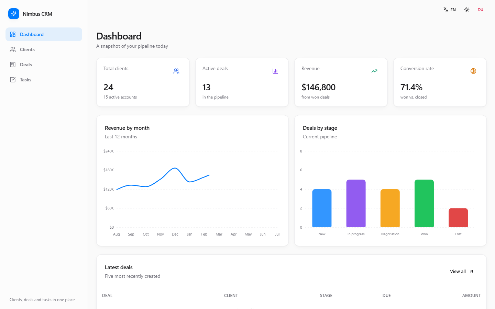
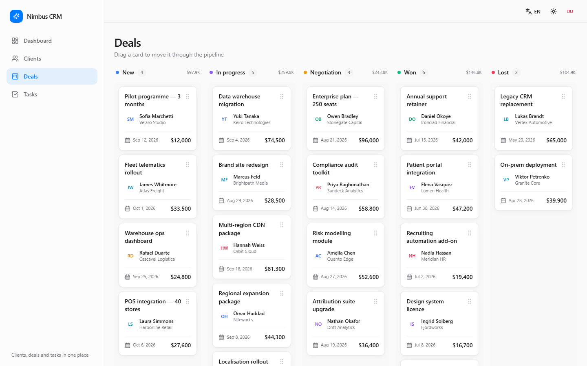

# Nimbus CRM

**Language:** 🇬🇧 [English](README.md) · 🇷🇺 [Русский](README.ru.md)

**[Live Demo](https://bringto-dot.github.io/nimbus-crm-dashboard/)**



A CRM dashboard focused on interface quality, realistic application flows,
and structured front-end architecture.

Nimbus brings together the main workflows of a small CRM in one interface:
performance overview, client management, deal pipeline, and task tracking.
The application runs entirely in the browser using mock data, making every
part of the interface available in the live demo without a separate
backend.

## Overview

The application is built around several connected CRM workflows rather than
a single dashboard screen.

The dashboard provides an overview of key metrics, revenue trends, deal
stages, and recent activity.

The clients section handles searchable and sortable records, status
filtering, create/edit forms, validation, and deletion with confirmation.

The deals section uses a five-stage Kanban pipeline where deals can be moved
between stages through drag-and-drop.

The tasks section connects tasks with clients and combines due dates,
priorities, and completion state in a compact workflow.

## Interface

### Dashboard

The main dashboard combines KPI cards, a revenue chart, a deal-stage chart,
and a recent-deals table.

The layout keeps the most important information visible without turning
the page into a collection of disconnected widgets.

### Deal pipeline

The Deals page is built around a five-column Kanban:

`New → In Progress → Negotiation → Won / Lost`

Dragging works with pointer and touch input, while keyboard sensors provide
an additional interaction method.



### Clients and tasks

Client records can be searched, filtered, sorted, created, edited, and
removed. Deleting a client also removes the related deals and tasks from
the application state.

Tasks are presented as a focused checklist with client links, due dates,
priorities, and open/done filtering.

## Design and responsive behavior

The interface supports both light and dark themes, with the selected theme
persisted between sessions.

Russian and English are available throughout the application. Dates and
currency values are formatted according to the active locale.

The desktop sidebar turns into a mobile drawer on smaller screens. Tables
hide secondary columns instead of forcing the page into horizontal
overflow, while the Kanban board keeps its columns accessible through
horizontal scrolling.

The responsive layout was checked at 375px and 1440px.

## Front-end architecture

The application is organized around domain-specific modules instead of
placing all dashboard logic in a single page.

```text
src/
├── components/
│   ├── ui/
│   ├── common/
│   ├── layout/
│   ├── dashboard/
│   ├── clients/
│   ├── deals/
│   └── tasks/
├── data/
├── hooks/
├── i18n/
├── lib/
├── pages/
├── store/
└── types/
```

The main domain models are `Client`, `Deal`, and `Task`. Application
mutations are exposed through named Zustand actions, while derived values
such as KPIs and deal-stage grouping are kept in selectors.

This keeps UI components focused on presentation and interaction while
application state and derived data remain separate.

## Details that matter

### Typed domain model

TypeScript runs with strict checks, including unused-variable and
implicit-return checks. Domain types are shared across the store,
selectors, forms, and UI components.

### Drag-and-drop

The Kanban uses `@dnd-kit` with pointer, touch, and keyboard sensors. Touch
interaction includes an activation delay so normal page scrolling is not
accidentally captured by the drag system.

### Localization

The English dictionary defines the translation keys used by the
application, while the Russian dictionary is required to implement the
same structure. Missing translations therefore become a type-level problem
instead of silently producing empty UI text.

### Theme persistence

Theme and language preferences are persisted with Zustand. The theme class
is applied before React mounts, avoiding a visible theme switch during the
initial page load.

## Deployment

The project is deployed to GitHub Pages.

Every push to `main` builds the application and publishes the resulting
`dist` directory through GitHub Actions. Production routing uses
`HashRouter` to work with GitHub Pages without server-side route rewrites.

## Project scope

Nimbus CRM uses mock data and browser storage rather than a production
backend. The goal is to demonstrate the interface, application state,
interaction patterns, responsive behavior, and front-end organization in a
self-contained project.

## Result

Nimbus CRM demonstrates how a dashboard can be developed as a complete
product interface rather than a collection of isolated screens: data views,
forms, filters, Kanban interactions, state management, localization,
themes, and responsive layouts all work together as one application.
