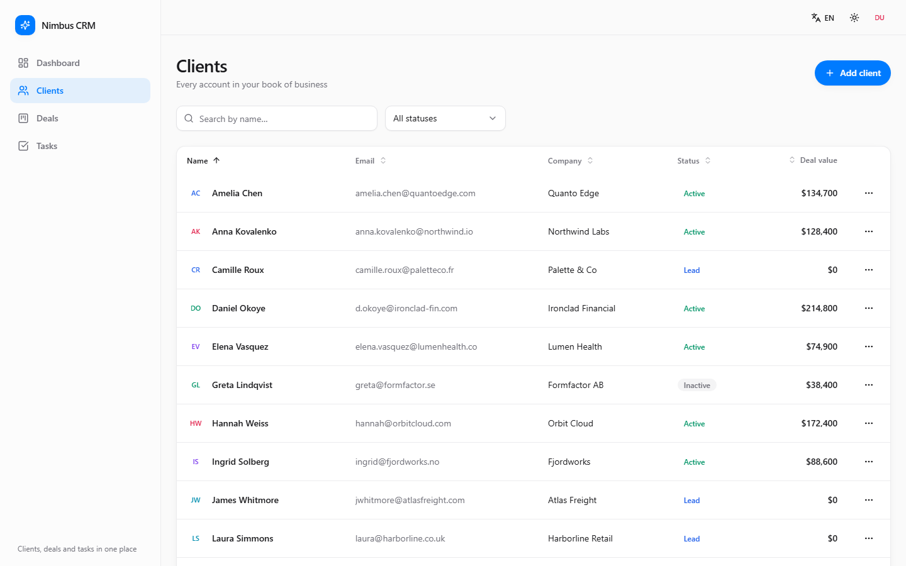
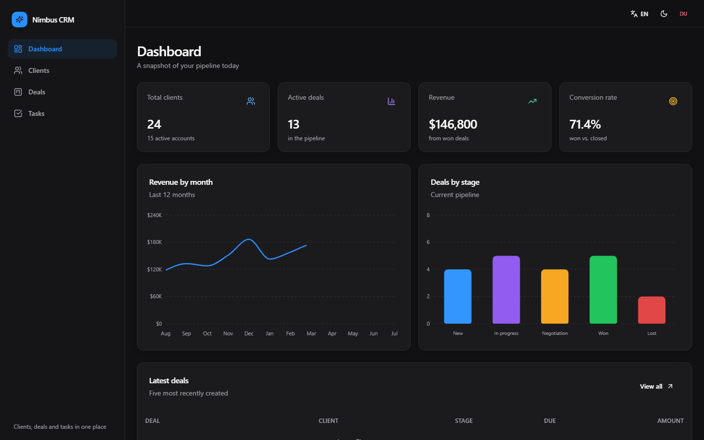
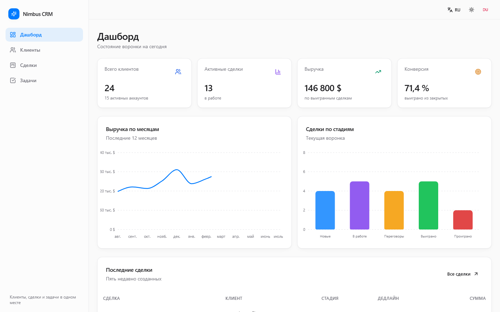
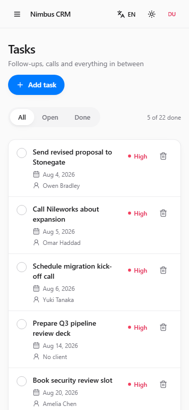
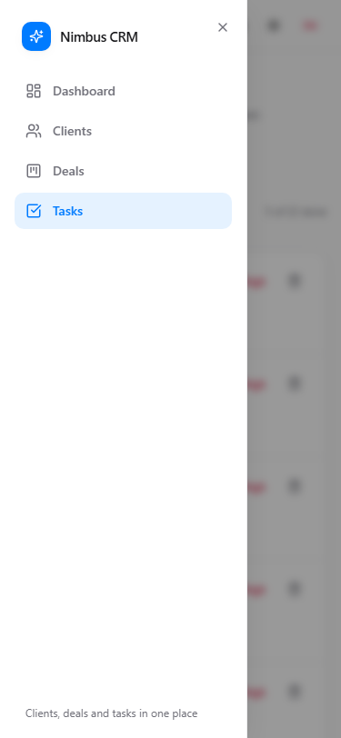

# Nimbus CRM

A CRM dashboard built to showcase front-end engineering: a typed data layer, a
drag-and-drop pipeline board, full light/dark theming, and a bilingual UI —
all running against an in-memory mock backend so the whole thing works
entirely in the browser.

**[Live demo →](https://bringto-dot.github.io/nimbus-crm-dashboard/)**

Sign in with any email and any password of 6+ characters — there's no real
backend, so nothing you type is validated against a server or stored anywhere
but your own browser's `localStorage`.


## Stack

React 18 · TypeScript (`strict`) · Vite · Tailwind CSS · Radix UI primitives ·
Zustand · React Router · Recharts · `@dnd-kit` · lucide-react

## Features

- **Dashboard** — four KPI cards, a revenue line chart, a deals-by-stage bar
  chart, and a table of the five most recent deals.
- **Clients** — search, status filter, sortable columns, a create/edit
  dialog with validation, and delete with confirmation.
- **Deals** — a five-column Kanban board (New → In Progress → Negotiation →
  Won / Lost) with pointer, touch, and keyboard drag-and-drop.
- **Tasks** — a checklist with client links, due dates, and colour-coded
  priority, filterable by open/done.
- **Theming** — light/dark, persisted, applied before first paint (no flash).
- **Localization** — full English/Russian UI switch, dates and currency
  formatted per-locale via `Intl`.
- **Responsive** — sidebar collapses into a slide-out drawer below `lg`;
  verified at 375px and 1440px with zero horizontal page scroll.
- **Loading states** — skeletons and empty states on every list/table, not
  just a spinner.

<table>
<tr>
<td></td>
<td></td>
</tr>
<tr>
<td></td>
<td></td>
</tr>
</table>

 

## Running locally

```bash
npm install
npm run dev
```

Open `http://localhost:5173`.

Other scripts: `npm run build` (`tsc -b && vite build`), `npm run preview`,
`npm run typecheck`.

## Pages

| Route        | What's there |
| ------------ | ------------ |
| `/login`     | Validated sign-in form, redirects to the dashboard, state in `useAuthStore` |
| `/dashboard` | KPI cards, revenue and pipeline charts, latest-deals table |
| `/clients`   | Search, status filter, sortable table, create/edit dialog, delete with confirmation |
| `/deals`     | Kanban board with drag-and-drop across five stages |
| `/tasks`     | Checklist with client link, due date, priority, and open/done filters |

Protected routes are gated by `ProtectedRoute`; unknown paths render a 404.

## Project structure

```
src/
  components/
    ui/         shadcn/ui-style primitives (button, card, dialog, select, table…)
    common/     shared building blocks (EmptyState, ConfirmDialog, PageHeader, skeletons)
    layout/     sidebar, header, mobile drawer, theme/language toggles
    dashboard/  KPI cards, charts, latest-deals table
    clients/    toolbar, table, sortable headers, client form
    deals/      deal card, stage column, kanban board
    tasks/      task item, filters, task form
  data/         mock JSON: 24 clients, 20 deals, 22 tasks, 12 months of revenue
  hooks/        usePageTitle, useThemeEffect, useClientFilters
  i18n/         en/ru dictionaries and the useTranslation hook
  lib/          cn(), currency/date formatters, stage/status constants
  pages/        Login, Dashboard, Clients, Deals, Tasks, NotFound
  store/        useCrmStore (data + actions), useAuthStore, usePreferencesStore, selectors
  types/        Client, Deal, Task and their derived types
```

## Notable implementation details

- **Typing.** `strict: true` plus `noUnusedLocals` / `noUnusedParameters` /
  `noImplicitReturns`. Domain types (`Client`, `Deal`, `Task`) live in
  `src/types` and flow through the store, selectors, and every form.
- **Store.** All mutations go through named actions
  (`addClient`, `updateClient`, `deleteClient`, `moveDeal`, `addTask`,
  `toggleTask`, `deleteTask`). Deleting a client cascades to their deals and
  tasks. Derived values (KPIs, stage grouping) are pure functions in
  `store/selectors.ts`, kept separate from the store so they're trivial to
  unit test.
- **Loading.** `loadData()` simulates a network round trip, so the skeleton
  states are actually exercised rather than only existing on paper.
- **Theme & language.** Persisted to `localStorage` via `zustand/persist`;
  the theme class is applied by an inline script in `index.html` before
  React mounts, so there's no light-mode flash on load.
- **i18n.** A small hand-rolled layer: the `en` dictionary defines the key
  type, and `ru` must implement it in full — a missing translation is a
  compile error, not a runtime blank string. Dates and currency are
  formatted through `Intl` for the active locale.
- **Drag and drop.** `@dnd-kit` sensor options are hoisted to module-level
  constants. Passing inline option objects to `useSensor` makes it rebuild
  the sensor on every render, which silently aborts an in-progress drag —
  a real bug I hit and fixed while building this, not a hypothetical one.
  Pointer, touch (with an activation delay so scrolling isn't hijacked),
  and keyboard sensors are all wired up.
- **Responsive.** Verified at 375px and 1440px: the sidebar collapses into a
  drawer below `lg`, the kanban board scrolls horizontally on narrow
  screens, and tables hide secondary columns rather than overflowing.

## Deployment

Every push to `main` runs [`.github/workflows/deploy.yml`](.github/workflows/deploy.yml),
which builds the app and publishes `dist/` to GitHub Pages via
`actions/deploy-pages`. The router switches to `HashRouter` in production
since Pages serves static files with no server-side rewrites — a path-based
router would 404 on refresh or a direct link.

## License

MIT
