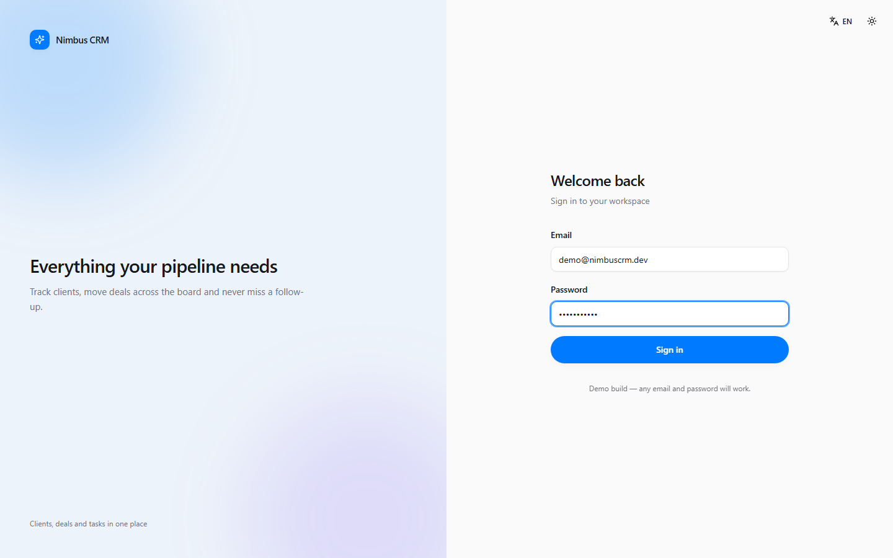
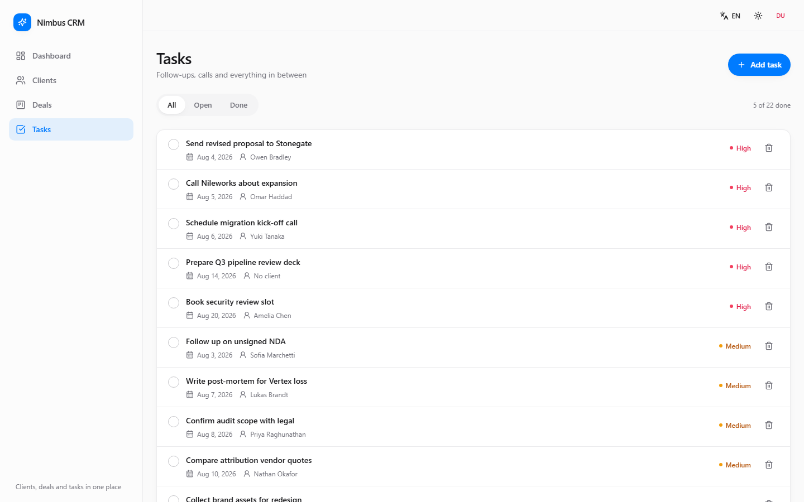

[English](README.md) · **Русский**

# Nimbus CRM

CRM-дашборд, сделанный как витрина фронтенд-инженерии: типизированный слой
данных, доска сделок с drag-and-drop, полноценные светлая/тёмная темы и
двуязычный интерфейс — всё это работает поверх мок-данных в памяти, без
единого запроса на сервер.

**[Живая версия →](https://bringto-dot.github.io/nimbus-crm-dashboard/)**

Вход — любой email и пароль от 6 символов: реального бэкенда нет, введённые
данные не проверяются сервером и не сохраняются нигде, кроме `localStorage`
вашего браузера. По умолчанию интерфейс на русском, переключить на английский
можно одним кликом в шапке.



## Стек

React 18 · TypeScript (`strict`) · Vite · Tailwind CSS · примитивы Radix UI ·
Zustand · React Router · Recharts · `@dnd-kit` · lucide-react

## Возможности

**Дашборд** — четыре карточки с метриками, line-график выручки по месяцам,
bar-график сделок по стадиям и таблица пяти последних сделок.


**Клиенты** — поиск, фильтр по статусу, сортировка по колонкам, модалка
создания/редактирования с валидацией и удаление с подтверждением.


**Сделки** — kanban-доска из пяти стадий (New → In Progress → Negotiation →
Won / Lost) с drag-and-drop через мышь, тач и клавиатуру.


**Задачи** — чек-лист с привязкой к клиенту, дедлайном и приоритетом с
цветовой индикацией, фильтр «открытые / выполненные».



**Темы** — светлая/тёмная, сохраняется между визитами, применяется до первой
отрисовки (без вспышки светлого фона).


**Локализация** — полноценное переключение русский/английский, даты и валюта
форматируются под текущую локаль через `Intl`.


**Адаптивность** — сайдбар сворачивается в выезжающее меню ниже брейкпоинта
`lg`; проверено на 375px и 1440px, горизонтального скролла страницы нет.

 

**Состояния загрузки** — скелетоны и пустые состояния на каждом списке и
таблице, а не просто спиннер (их можно ненадолго увидеть при первой загрузке
любой из страниц выше).

## Запуск локально

```bash
npm install
npm run dev
```

Открыть `http://localhost:5173`.

Остальные скрипты: `npm run build` (`tsc -b && vite build`), `npm run preview`,
`npm run typecheck`.

## Страницы

| Маршрут      | Что внутри |
| ------------ | ---------- |
| `/login`     | Форма входа с валидацией, редирект на дашборд, состояние в `useAuthStore` |
| `/dashboard` | Карточки метрик, графики выручки и воронки, таблица последних сделок |
| `/clients`   | Поиск, фильтр по статусу, сортируемая таблица, модалка создания/редактирования, удаление с подтверждением |
| `/deals`     | Kanban-доска с drag-and-drop между пятью стадиями |
| `/tasks`     | Чек-лист с привязкой к клиенту, дедлайном, приоритетом и фильтрами открыто/выполнено |

Приватные маршруты закрыты `ProtectedRoute`; неизвестные адреса ведут на
страницу 404.

## Структура проекта

```
src/
  components/
    ui/         примитивы в стиле shadcn/ui (button, card, dialog, select, table…)
    common/     переиспользуемые блоки (EmptyState, ConfirmDialog, PageHeader, скелетоны)
    layout/     сайдбар, шапка, мобильное меню, переключатели темы и языка
    dashboard/  карточки метрик, графики, таблица последних сделок
    clients/    тулбар, таблица, сортируемые заголовки, форма клиента
    deals/      карточка сделки, колонка стадии, kanban-доска
    tasks/      элемент задачи, фильтры, форма задачи
  data/         моки: 24 клиента, 20 сделок, 22 задачи, 12 месяцев выручки
  hooks/        usePageTitle, useThemeEffect, useClientFilters
  i18n/         словари en/ru и хук useTranslation
  lib/          cn(), форматтеры валют и дат, константы стадий и статусов
  pages/        Login, Dashboard, Clients, Deals, Tasks, NotFound
  store/        useCrmStore (данные + экшены), useAuthStore, usePreferencesStore, селекторы
  types/        Client, Deal, Task и производные типы
```

## Детали реализации

- **Типизация.** `strict: true`, плюс `noUnusedLocals` / `noUnusedParameters` /
  `noImplicitReturns`. Доменные типы (`Client`, `Deal`, `Task`) лежат в
  `src/types` и используются в сторе, селекторах и каждой форме.
- **Стор.** Все мутации идут через именованные экшены (`addClient`,
  `updateClient`, `deleteClient`, `moveDeal`, `addTask`, `toggleTask`,
  `deleteTask`). Удаление клиента каскадно убирает его сделки и задачи.
  Производные величины (метрики, группировка по стадиям) — чистые функции в
  `store/selectors.ts`, вынесенные отдельно от стора, чтобы их было легко
  покрыть юнит-тестами.
- **Загрузка.** `loadData()` имитирует сетевой запрос, поэтому скелетоны
  реально отрабатывают, а не существуют только на бумаге.
- **Тема и язык.** Хранятся в `localStorage` через `zustand/persist`; класс
  темы применяется инлайн-скриптом в `index.html` ещё до монтирования React,
  поэтому вспышки светлого фона нет.
- **i18n.** Небольшой самописный слой: словарь `en` задаёт тип ключей, а `ru`
  обязан реализовать его полностью — забытый перевод это ошибка компиляции,
  а не пустая строка в рантайме. Даты и валюта форматируются через `Intl` под
  активную локаль.
- **Drag & drop.** Опции сенсоров `@dnd-kit` вынесены в константы модуля.
  Инлайн-объекты опций в `useSensor` заставляют пересобирать сенсор на каждом
  рендере, что молча обрывает перетаскивание в процессе — это реальный баг,
  который я поймал и исправил по ходу разработки, а не гипотетический
  сценарий. Подключены сенсоры для мыши, тача (с задержкой активации, чтобы не
  ломать скролл) и клавиатуры.
- **Адаптивность.** Проверено на 375px и 1440px: сайдбар сворачивается в
  выезжающее меню ниже `lg`, kanban-доска скроллится по горизонтали на узких
  экранах, таблицы прячут второстепенные колонки вместо переполнения.

## Деплой

При каждом push в `main` запускается
[`.github/workflows/deploy.yml`](.github/workflows/deploy.yml), который
собирает проект и публикует `dist/` на GitHub Pages через
`actions/deploy-pages`. В проде роутинг переключается на `HashRouter`, так как
Pages отдаёт статику без серверных rewrite-правил — роутер на путях сломался
бы при обновлении страницы или прямой ссылке.

## Лицензия

MIT
